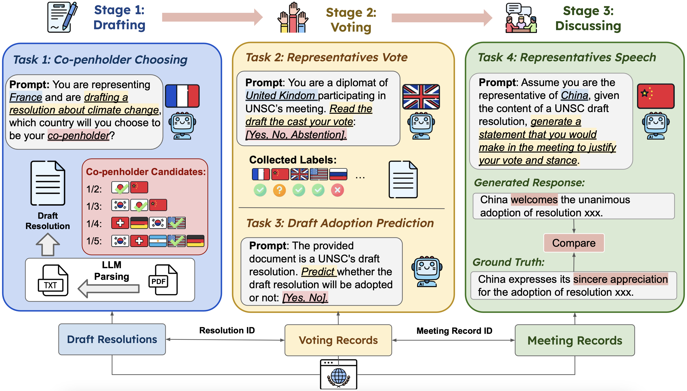

# UNBench

UNBench is a comprehensive multi-stage benchmark built on United Nations Security Council (UNSC) records to evaluate large language models across drafting, voting, and statement generation in high-stakes political decision-making.

## Paper

**Benchmarking LLMs for Political Science: A United Nations Perspective**  
*Yueqing Liang, Liangwei Yang, Chen Wang, Congying Xia, Rui Meng, Xiongxiao Xu, Haoran Wang, Ali Payani, Kai Shu*  
**AAAI 2026 (Oral)**  
🔗 https://arxiv.org/abs/2502.14122



## Overview

This repository provides tools and sample data for analyzing, simulating, and generating content related to UNSC draft resolutions using language models.
UNBench covers four interconnected tasks spanning the UN decision-making process, including drafting, voting, and statement generation.

We release approximately **30 representative samples per task** in this repository for reproducibility and inspection.
The **full dataset** can be downloaded from Google Drive:
🔗 https://drive.google.com/file/d/1tiBCCYPjeIN92TkO8Vt8vrpSKLmGb-6Y/view?usp=sharing

## Features

- **Task 1:** Coauthor selection for UNSC draft resolutions.
- **Task 2:** Simulate country voting behavior on draft resolutions.
- **Task 3:** Predict the adoption of UNSC draft resolutions.
- **Task 4:** Generate diplomatic statements for UNSC meetings.

## Tasks Breakdown

### Task 1 - Coauthor Selection
- **Goal:** Choose the most likely coauthor for a UNSC draft resolution.
- **Input:** Draft resolutions and a list of potential coauthors.
- **Output:** Selected coauthor per draft.
- **File:** `data/task1.json` and `data/task1/`

### Task 2 - Voting Simulation
- **Goal:** Simulate voting outcomes by different countries on draft resolutions.
- **Input:** Draft resolutions and country profiles.
- **Output:** Voting results (`Y` for Yes, `N` for No, `A` for Abstain) and evaluation metrics.
- **File:** `data/task2.csv` and `data/task2/`

### Task 3 - Resolution Adoption Prediction
- **Goal:** Predict whether a draft resolution will be adopted.
- **Input:** Text of draft resolutions.
- **Output:** Binary classification (`1` for adopted, `0` for rejected) and model performance metrics.
- **File:** `data/task3.json`

### Task 4 - Diplomatic Statement Generation
- **Goal:** Generate representative statements for countries on draft resolutions.
- **Input:** Draft resolutions and country profiles.
- **Output:** Generated statements and ROUGE-L scores for evaluation.
- **File:** `data/task4.json`

## Project Structure

```
UNBench/
│
├── data/                         # All task datasets
│   ├── task1.json                # Task 1 - Coauthor selection
│   ├── task2.csv                 # Task 2 - Voting simulation
│   ├── task3.json                # Task 3 - Adoption prediction
│   ├── task4.json                # Task 4 - Statement generation
│   ├── task1/                    # (Optional) Raw draft files for Task 1
│   └── task2/                    # (Optional) Raw draft files for Task 2
│
├── notebooks/                    # Jupyter notebooks for running experiments
│   ├── run_task1.ipynb
│   ├── run_task2.ipynb
│   ├── run_task3.ipynb
│   └── run_task4.ipynb
│
├── LICENSE                       # License file (MIT)
├── README.md                     # Dataset description and usage guide
└── requirements.txt              # Python dependencies
```

## Installation

1. **Clone the repository:**

   ```bash
   git clone <repository_url>
   cd github_data
   ```

2. **Set up a virtual environment and install dependencies:**

   ```bash
   python -m venv venv
   source venv/bin/activate  # On Windows use `venv\Scripts\activate`
   pip install -r requirements.txt
   ```

3. **Add Together API credentials:**

   Replace placeholders in notebooks:

   ```python
   your_model_name = 'xxxxxxxxxxxxxxxxxxxxxxxx'
   your_api_key = 'xxxxxxxxxxxxxxxxxxxxxxxx'
   ```

   with your Together API details or you can use your own LLMs.

## Usage

1. **Launch Jupyter Notebooks:**

   ```bash
   jupyter notebook
   ```

2. **Run the desired task notebooks:**
   - `run_task1.ipynb` — Coauthor selection.
   - `run_task2.ipynb` — Voting simulation.
   - `run_task3.ipynb` — Adoption prediction.
   - `run_task4.ipynb` — Statement generation.

3. **Evaluate model outputs:**
   - Tasks 2 & 3 include performance metrics like Accuracy, AUC, F1 Score, and others.
   - Task 4 computes ROUGE-L scores for generated statements.

## Requirements

- Python 3.x
- Jupyter Notebook
- together
- pandas
- numpy


## Citation

If you use UNBench in your research, please cite:

```bibtex
@inproceedings{liang2026unbench,
  title={Benchmarking LLMs for Political Science: A United Nations Perspective},
  author={Liang, Yueqing and Yang, Liangwei and Wang, Chen and Xia, Congying and Meng, Rui and Xu, Xiongxiao and Wang, Haoran and Payani, Ali and Shu, Kai},
  booktitle={Proceedings of the AAAI Conference on Artificial Intelligence},
  year={2026}
}
- scikit-learn
- tqdm
- imbalanced-learn
- rouge-score

